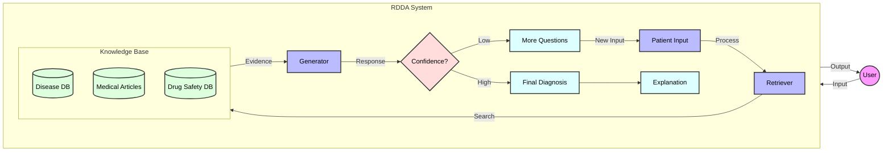
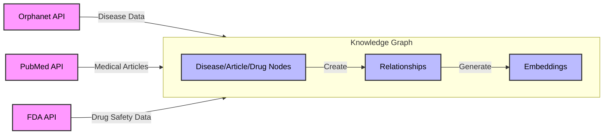

# Rare Disease Diagnosis Assistant (RDDA)

An explainable, interactive, RAG-based AI assistant for supporting rare disease diagnosis, capable of handling uncertainty, surfacing case-based evidence, and generating follow-up questions.

## 🎯 Project Goals

- Build an uncertainty-aware RAG system for rare disease diagnosis
- Implement interactive diagnosis with multi-turn dialogue
- Integrate knowledge graphs with RAG for improved reasoning
- Provide explainable and trustworthy diagnostic suggestions
- Support multimodal input processing

## 🛠️ System Architecture

### Core Components

1. **Retriever**
   - Dense retrieval using BioBERT/GatorTron embeddings
   - Knowledge graph integration (UMLS/Orphanet)
   - Uncertainty-aware retrieval mechanisms

2. **Generator**
   - Large Language Model integration (GPT-4/LLaMA-2/Mistral)
   - Follow-up question generation
   - Confidence scoring and uncertainty quantification

3. **Knowledge Base**
   - PubMed/MedlinePlus integration
   - Orphanet rare disease database
   - FDA (OpenFDA API) integration for drug safety and adverse events

4. **Evaluation Framework**
   - Diagnostic accuracy metrics
   - Factual correctness verification
   - Trust and explainability scoring

### System Flow



> This diagram shows the simplified flow of the Rare Disease Diagnosis Assistant (RDDA) system. The system takes patient input, searches multiple knowledge bases, processes the information, and provides either a diagnosis or follow-up questions based on confidence level.

### Knowledge Graph Construction



> The knowledge graph is constructed by integrating data from multiple sources. We create nodes for diseases, articles, and drug safety information, then establish relationships between them. Each node and relationship is embedded using sentence transformers for semantic search capabilities.

## 🚀 Getting Started

1. Clone the repository
2. Install dependencies:
   ```bash
   pip install -r requirements.txt
   ```
3. Set up environment variables:
   ```bash
   cp .env.example .env
   # Edit .env with your API keys and configuration
   ```
4. Run the development server:
   ```bash
   uvicorn app.main:app --reload
   ```

## 📚 Project Structure

```
.
├── app/
│   ├── api/            # FastAPI endpoints
│   ├── core/           # Core RAG components
│   ├── models/         # Data models
│   ├── retrievers/     # Retrieval implementations
│   ├── generators/     # LLM integration
│   └── utils/          # Utility functions
├── data/               # Data processing scripts
├── tests/              # Test suite
├── notebooks/          # Jupyter notebooks for experiments
└── docs/              # Documentation
```

## 📊 Evaluation

The system is evaluated on multiple metrics:
- Diagnostic accuracy (RareBench, DDXPlus, MedQA)
- Factual correctness
- Justification quality
- Trust score
- Rare disease coverage
- System efficiency

## 🤝 Contributing

Please read [CONTRIBUTING.md](CONTRIBUTING.md) for details on our code of conduct and the process for submitting pull requests.


## 📞 Contact

For questions and support, please open an issue in the repository.

# Knowledge Graph for Orphanet and PubMed Data

This project integrates data from Orphanet and PubMed into a knowledge graph. The graph is stored in a JSON file (default: `test_graph.pkl`).

## Features

- **Disease and Article Nodes**: Each node has a `name` attribute. For diseases, it uses the disease name; for articles, it uses the article title.
- **Edges**: Relationships between nodes (e.g., disease-to-article, disease-to-phenotype) are stored as edges.
- **Semantic Search**: The graph supports semantic search using sentence embeddings.
- **Network Analysis**: You can analyze the disease network, including the number of nodes and edges.

## Running the Test Script

To run the test script, ensure you have set the required API keys:

```bash
export ORPHANET_API_KEY=your_orphanet_api_key
export PUBMED_API_KEY=your_pubmed_api_key
```

Then run:

```bash
python -m app.test_knowledge_graph
```

The script will:
- Add a disease (e.g., Marfan syndrome) from Orphanet.
- Search for related articles from PubMed.
- Add articles to the graph and link them to the disease.
- Print the number of nodes and edges in the graph.
- Save the graph to `test_graph.pkl` (the file path will be clickable in the terminal).

## Graph Storage

The knowledge graph is saved as a JSON file. The default file is `test_graph.pkl`. You can change the file path in the test script if needed.

## Troubleshooting

- **0 Edges**: If the graph shows 0 edges, check that the node IDs used in `add_node` and `add_edge` are consistent. Ensure that relationships (e.g., `link_disease_to_article`) are called correctly.
- **File Path**: The file path is printed as an absolute path, making it clickable in most modern terminals.

## Dependencies

- Python 3.6+
- NetworkX
- SentenceTransformer
- Requests

## License

This project is licensed under the MIT License. 